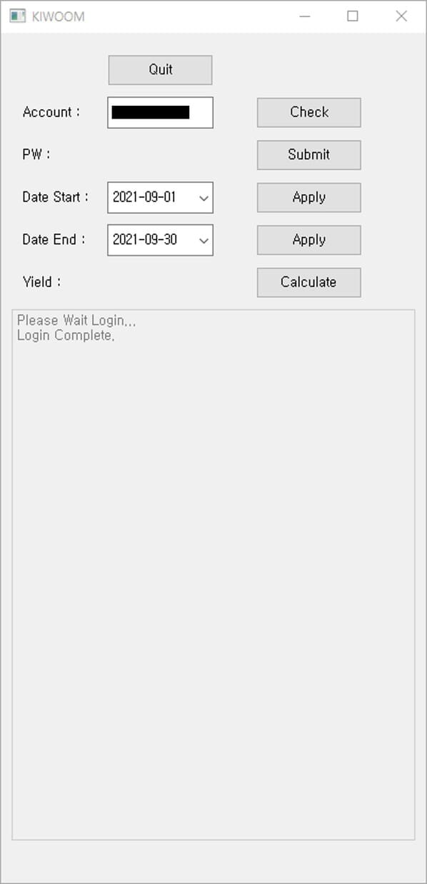
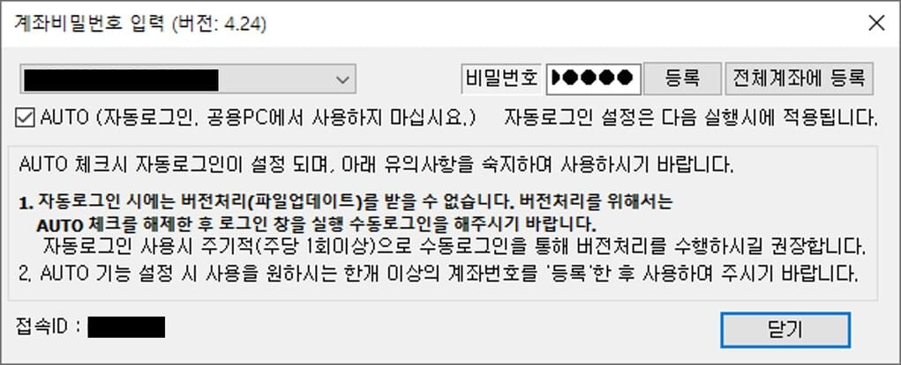

# KIWOOM OpenAPI Daily Return Calculator

**KIWOOM OpenAPI Daily Return Calculator v1.1**

**키움증권 OpenAPI+** 를 활용한 기간별 계좌 수익률 계산기

## Task List

| Name      | Desc.                                                                      |
| :--:      | :----                                                                      |
| Quit      | 프로그램 종료                                                               |
| Check     | OpenAPI+ 에 로그인 된 전체 계좌 조회 ( Latest : 계좌 1개일 때만 사용 가능 ) |
| Submit    | 계좌 비밀번호 입력창 실행                                                    |
| Apply     | 달력에서 선택한 날짜 적용 (v1.0 : Apply 클릭해야 선택한 날짜 적용)          |
| Calculate | 해당 기간 계좌 수익률 계산                                                   |

## Run v1.0
<table style="border-collapse: separate; border-spacing: 10px 10px;">
    <tr>
        <td style="border: none;"><h3>시작 화면</h3></td>
        <td style="border: none;"><h3>날짜 선택</h3></td>
    </tr>
    <tr>
        <td style="border: none;"></td>
        <td style="border: none;"></td>
    </tr>
    <tr>
        <td colspan="2" style="border: none;"><h3>비밀번호 입력창</h3></td>
    </tr>
    <tr>
        <td colspan="2" style="border: none;"></td>
    </tr>
    <tr>
        <td colspan="2" style="border: none;"><h3>결과</h3></td>
    </tr>
    <tr>
        <td colspan="2" style="border: none;"></td>
    </tr>
</table>

## Update History

### v1.2

- Window 크기 조정
- 달력에서 날짜 선택 가능
- 날짜 적용 버튼 삭제
- 시작일, 종료일이 서로 초과할 수 없도록 수정
- 종료일이 오늘을 초과할 수 없도록 수정
- 자동 비밀번호 입력 임시 사용
- **[BUG] 기간 수익률 조회 시, 첫째 날 수익률 출력 오류** 

### v1.1

- Yield > Return으로 변경 
- Window 크기 및 레이아웃 조정
- Create 함수를 추가하여 코드 간소화

### v1.0

- 프로그램 최초 업로드
- 계좌 1개일 때 계좌 확인 가능
- 날짜 선택 시, Apply 버튼 클릭해야 선택한 날짜 적용

 

---
**Updated :** 2021-10-03 01:32
